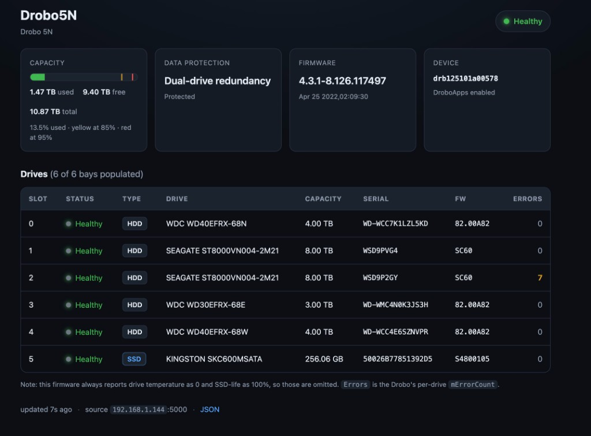
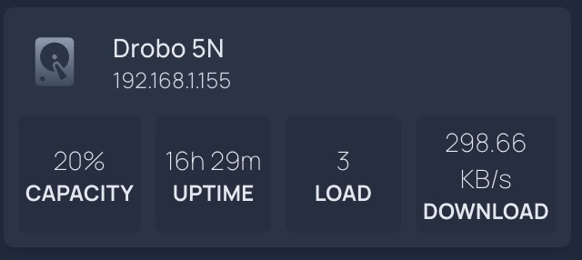

# Drobo 5N Dashboard

# THIS APP IS COMPLETELY VIBE-CODED USE AT YOUR OWN RISK

# DROBO IS A BANKRUPT COMPANY AND THEIR HARDWARE IS NO LONGER SUPPORTED

# I JUST WANTED TO MONITOR MY DROBO 5N SO IT DID NOT TURN INTO E-WASTE

If you make a PR or change I might review it but probably best to just fork, open to suggestions tho.

A small, from-scratch Python/Flask web app that revives monitoring for a
**Drobo 5N** whose official Dashboard no longer runs on modern operating
systems. It shows live drive health, capacity, redundancy, per-drive error
trends, throughput, and hardware telemetry — in a clean, auto-refreshing UI
styled after the classic Drobo Dashboard.



> **New here?** Read [`docs/DROBO-5N.md`](docs/DROBO-5N.md) — the consolidated
> knowledge base for this exact device (protocols, fields, capacity math, and
> the hard-won gotchas). Working on the code? See [`AGENTS.md`](AGENTS.md).

## Why this exists (and why no Linux VM is needed)

The old Drobo Dashboard app no longer runs on current OSes, and
[`drobo-utils`](https://drobo-utils.sourceforge.net/) does **not** help: it only
works with *direct-attached* Drobos that appear as a `/dev/sdX` block device.
The **5N is network-only**.

Instead, the 5N runs a status daemon that streams an XML document on **TCP port
5000** (unauthenticated). Connect, read one `<ESATMUpdate>` document, and you get
everything the old Dashboard showed. For the extras the stream *doesn't* carry
(CPU, RAM, throughput), the app **SSHes into the box and reads `/proc`**. It all
runs straight from macOS — no VM required.

## Features

- **Overview (`/`)** — classic per-bay status lights, capacity, redundancy,
  firmware, per-drive error counts, plus live **throughput** and **system**
  mini-panels.
- **Storage (`/storage`)** — old-Dashboard-style **capacity pie** (used / free /
  unallocated) with a correct **BeyondRAID zone-model** breakdown of protection
  vs. reserved-for-expansion, and capacity history.
- **Errors (`/errors`)** — timeline of per-drive `mErrorCount` changes (logged
  locally since the device doesn't timestamp them) plus a lookup "database"
  explaining error counts, disk-state, and rotational-speed codes.
- **Hardware (`/hardware`)** — CPU (overall + per-core), memory, load, uptime,
  disk I/O, and top processes, over time. Sourced over SSH.
- **Details (`/stats`)** — every field we can extract, raw and decoded.
- **Settings (`/settings`)** — identify (blink lights) / restart. **Off by
  default**; opt in with `DROBO_ENABLE_CONTROL=1`.

## Requirements

- Python 3.12+ and [`uv`](https://docs.astral.sh/uv/)
- Network line-of-sight to the Drobo (default `192.168.1.144`)
- For the throughput/hardware panels: the Drobo's SSH `admin` login (the app
  degrades gracefully without it)

## Run it

```sh
cd drobo-dashboard
cp deploy/.env.example .env   # set DROBO_HOST and DROBO_PASSWORD
uv run app.py                 # or: uv run main.py
```

Then open <http://127.0.0.1:8765>. Pages auto-refresh (status ~15s; throughput
and system ~4s).

### Docker (production)

```sh
git clone git@github.com:kyllan16693/drobo-dashboard.git
cd drobo-dashboard
cp deploy/.env.example .env   # edit DROBO_HOST, DROBO_PASSWORD, etc.
mkdir -p data && chmod 777 data   # Linux: ensure container user can write SQLite
cd deploy && docker compose up --build -d
curl -s http://localhost:8765/healthz
curl -s http://localhost:8765/api/widget
```

See [`deploy/README.md`](deploy/README.md) for updates, secrets policy, and the
Homepage widget ([`deploy/homepage/`](deploy/homepage/)).

### Homepage widget

The [gethomepage](https://gethomepage.dev/) **customapi** tile shows Drobo
capacity, uptime, load, and live throughput from `GET /api/widget`. Setup and
YAML snippet: [`deploy/homepage/README.md`](deploy/homepage/README.md).



## Configuration

Set via environment or a local `.env` (loaded automatically). **Never commit
`.env`.**

| Variable | Default | Meaning |
|---|---|---|
| `DROBO_HOST` | — | Drobo IP / hostname (**required**) |
| `DROBO_PORT` | `5000` | NASD status port |
| `POLL_INTERVAL` | `15` | Seconds between NASD polls |
| `WEB_HOST` | `127.0.0.1` | Bind address (`0.0.0.0` to expose on LAN) |
| `WEB_PORT` | `8765` | Web server port |
| `DROBO_USERNAME` | — | SSH user for telemetry (this unit: `admin`) |
| `DROBO_PASSWORD` | — | SSH password (referenced by name only; never logged) |
| `DROBO_SSH_THROUGHPUT` | `1` | Enable the SSH network-throughput monitor |
| `DROBO_THROUGHPUT_INTERVAL` | `5` | Throughput sample interval (s) |
| `DROBO_NET_IFACE` | auto | Force a NIC name for throughput (else auto-detect) |
| `DROBO_SSH_HARDWARE` | `1` | Enable the SSH hardware (CPU/RAM/IO) monitor |
| `DROBO_HARDWARE_INTERVAL` | `5` | Hardware sample interval (s) |
| `DROBO_DB_PATH` | `data/history.db` | SQLite history file |
| `DROBO_ENABLE_CONTROL` | `0` | Enable the `/settings` write actions |

The unauthenticated NASD stream (port 5000) needs **no** credentials; only the
throughput/hardware SSH features use `DROBO_USERNAME` / `DROBO_PASSWORD`.

## Endpoints

| Route | Returns |
|---|---|
| `GET /` | Overview page |
| `GET /storage` · `/errors` · `/hardware` · `/stats` · `/settings` | pages |
| `GET /api/status` | parsed status snapshot + freshness |
| `GET /api/widget` | flat JSON for Homepage customapi widget |
| `GET /api/raw` | full raw/decoded field dump (for `/stats`) |
| `GET /api/storage` | capacity + BeyondRAID breakdown |
| `GET /api/reference` | error/code lookup tables |
| `GET /api/throughput` · `/api/hardware` | live SSH telemetry snapshots |
| `GET /api/history/{capacity,errors,throughput,hardware}` | time series (SQLite) |
| `GET /healthz` | `200` when fresh & reachable, else `503` |
| `POST /settings/{identify,stop-identify,restart}` | control (CSRF + opt-in) |

History endpoints accept a sanitized `?hours=` (and `?days=`/`?limit=`) query.

## Architecture

```
drobo-dashboard/
├─ app.py               Flask app: all routes + background monitors
├─ main.py              thin launcher -> app.main()
├─ drobo/               reusable core
│  ├─ client.py         socket read of port 5000 (handles framing)
│  ├─ parser.py         XML -> models (rejects DTDs; dedupes slots)
│  ├─ models.py         DroboStatus / DiskSlot dataclasses + formatting
│  ├─ codes.py          numeric codes -> labels (status, redundancy, RPM, state)
│  ├─ storage.py        BeyondRAID zone-model capacity breakdown
│  ├─ reference.py      lookup tables for the /errors page
│  ├─ poller.py         background thread; caches last-good + staleness
│  ├─ throughput.py     SSH /proc/net/dev network monitor
│  ├─ hardware.py       SSH /proc CPU/RAM/load/IO + top monitor
│  ├─ history.py        SQLite persistence (capacity, errors, tp, hardware)
│  ├─ control.py        DIRNETTM (port 5001) identify/restart
│  └─ rawdump.py        full field dump for /stats & /api/raw
├─ templates/*.html     one per page
├─ static/*.{js,css}    per-page assets + shared base.css / charts.js
├─ docs/DROBO-5N.md     device knowledge base
├─ RESEARCH-*.md        extraction & control-protocol research
└─ tests/sample_5n.xml  captured live document for offline testing
```

Three background daemon threads (NASD poller, throughput, hardware) sample on
timers and cache the last-good snapshot, so web requests are fast, the aging
device isn't hammered, and the page keeps showing data (with a "stale" badge)
during brief dropouts. The `drobo/` core parsing package is pure standard
library and reusable:

```python
from drobo import read_raw, parse
status = parse(read_raw("192.168.1.144"))
print(status.status_label, status.used_human, "/", status.total_human)
```

## Key field notes

- **Temperature is unavailable** on the 5N (`mTemperature` always `0`), and
  **real per-drive SMART cannot be read** — the physical disks are hidden behind
  the controller. Verified; see [`docs/DROBO-5N.md`](docs/DROBO-5N.md) §7. The
  UI shows "not reported" rather than faking it.
- **`mErrorCount`** is a cumulative soft-error tally (not a code); the app logs
  each increase so `/errors` can show *when* it changed.
- **`RotationalSpeed`** is a device code — RPM = code × 200 (`27` → 5400).
- Capacity math uses the **BeyondRAID zone model**, so "protection" vs
  "unallocated" is correct for mismatched drives (this unit: ~8 TB protection,
  ~8 TB unallocated), not the naive two-largest-drives shortcut.

## Testing / development

- Offline parsing test data: `tests/sample_5n.xml`.
- Lint before shipping; the project targets clean Python + JS.
- The dashboard has been hardened via adversarial review: XML-bomb (DTD)
  rejection, HTML-escaping/XSS safety on all device-derived strings, CSRF on
  control actions, and query-param sanitization (finite/bounded `hours`).

## References

- droboports — [NASD XML format](https://github.com/droboports/droboports.github.io/wiki/NASD-XML-format)
- [AndrewMobbs/drobomon](https://github.com/AndrewMobbs/drobomon) · [cosmouser/drobo_exporter](https://github.com/cosmouser/drobo_exporter)
